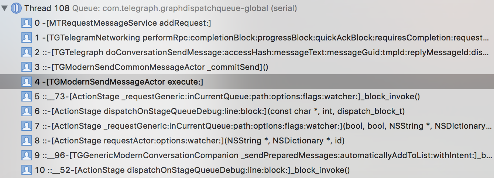

# Telegram
Telegram Messenger for iOS

### Download and Compile

```
$git clone https://github.com/NedColin/Telegram.git
$git submodule update --init
```
or [clone with submodules](https://stackoverflow.com/questions/3796927/how-to-git-clone-including-submodules)

```
git clone --recurse-submodules -j8 https://github.com/NedColin/Telegram.git

```


## Telegram源码分析
#### MTProto概念

  MTProto是Telegram自定义协议，该协议是为从运行在移动设备上的应用程序访问服务器API而设计的。特别提醒，web浏览器并不是这样的应用程序。
  
  协议可以细分为三个基本独立的组成部分:
  
  * 高级组件(API查询语言):定义将API查询和响应转换为二进制消息的方法。
  * 加密(授权)层:定义在传输协议传输之前加密消息的方法。
  * 传输组件:定义客户端和服务器的方法，使得协议能够在其他现有的网络协议(如HTTP、HTTPS、TCP、UDP)上传输消息。

 而MTProtokit是对MTProto协议在实现了OS x和iOS系统的一个实现和封装。
 
 
#### 服务端-客户端加密
服务端与客户端加密协议：
   

  
#### 点对点加密
点对点加密协议：


#### Telegram内置消息
服务端返回的消息称为内置消息，内置消息是实现MTProto的基础，主要的内置消息有：

  * [RPC响应消息](https://core.telegram.org/mtproto/service_messages)。

这里req_msg_id是另一方发送的消息的标识符，包含一个RPC查询。通过这种方式，接收方知道结果是对特定RPC查询的响应。
与此同时，此响应作为对另一方接收req_msg_id消息的确认。注意，对RPC查询的响应也必须得到确认。最常见的情况是，这与下一条消息的传输相一致(该消息可能有一个附加到该消息的容器，它携带一个服务消息和确认)。
  
  * RPC 错误
  * 取消RPC查询


### MTProto rpc服务初始化
所有的rpc服务的初始化通过类TGTLSerialization注册进行管理，TGTLSerialization的职能是序列化和反序列化rpc的二进制数据的报文，应用程序启动时，调用TLRegisterClasses注册所有的[rpc方法名](https://core.telegram.org/methods)，并且可以通过方法签名或者方法名字符串获取对应的rpc构造实例。

[TLMetaScheme.h]()

```
void TLRegisterClasses(){
......省略
TLMetaClassStore::registerObjectClass([TLRPChelp_getConfig$help_getConfig new]);
......省略
}
```

### MTProto的[服务器配置](https://core.telegram.org/api/datacenter)
服务器被划分为多个数据中心(以下简称DCs),这些DCs的代理访问点的完整列表可以通过
help.getConfig.

  [TGLocalizationSignals.m]()

```

+ (SSignal *)suggestedLocalization {
    return [[[TGTelegramNetworking instance] requestSignal:[[TLRPChelp_getConfig$help_getConfig alloc] init]] mapToSignal:^SSignal *(TLConfig *result) {
        if (result.suggested_lang_code.length != 0 && ![result.suggested_lang_code isEqual:currentNativeLocalization().code]) {
            return [self suggestedLocalizationData:result.suggested_lang_code];
        } else {
            return [SSignal single:nil];
        }
    }];
}
```

返回的result是一个TLConfig$config实例，this_dc是当前DC的索引，dc_options是当前可用的所有DCs的列表，每个DCs都有一个id、ip和用于建立连接的端口。

特别注意，基于代理服务器负载和用户当前位置，ip和端口可能经常更改。为了优化客户端与API的通信，每个客户端必须使用与最接近的访问点的连接(发送消息、获取联系人等)。因此，客户端实现了TGDatacenterWatchdogActor来监视所有的DCs的状态，以便选择最佳的服务中心。

```
- (void)requestNetworkConfigFromDatacenter:(NSInteger)datacenterId
{
    TGLog(@"[TGDatacenterWatchdogActor#%p requesting network config from %d]", self, (int)datacenterId);
    
    MTContext *context = [[TGTelegramNetworking instance] context];
    
    MTProto *mtProto = [[MTProto alloc] initWithContext:context datacenterId:datacenterId usageCalculationInfo:nil];
    MTRequestMessageService *requestService = [[MTRequestMessageService alloc] initWithContext:context];
    [mtProto addMessageService:requestService];
    
    _currentMtProto = mtProto;
    _currentRequestService = requestService;
    
    MTRequest *request = [[MTRequest alloc] init];
    request.dependsOnPasswordEntry = false;
    request.body = [[TLRPChelp_getConfig$help_getConfig alloc] init];
    
    __weak TGDatacenterWatchdogActor *weakSelf = self;
    [request setCompleted:^(TLConfig *result, __unused NSTimeInterval timestamp, id error)
    {
        [ActionStageInstance() dispatchOnStageQueue:^
        {
            __strong TGDatacenterWatchdogActor *strongSelf = weakSelf;
            if (error == nil)
            {
                [strongSelf processConfig:result fromDatacenterId:datacenterId];
            }
        }];
    }];
    
    [requestService addRequest:request];
}
```

### MTProto初始化

TGTelegramNetworking是一个单例，在App启动时，调用TGTelegramNetworking单例进行网络的初始化，应用启动的大致流程：
  
  1.TGTelegramNetworking初始化，并且读取上次的合适的数据中心id
  [TGTelegramNetworking.m]()

```
- (instancetype)initWithSocksProxyData:(NSData *)socksProxyData{
...省略...
        NSNumber *nDefaultDatacenterId = [_keychain objectForKey:@"defaultDatacenterId" group:@"persistent"];
        if (nDefaultDatacenterId == nil)
        {
            if (foundAuthorizations)
                nDefaultDatacenterId = @(1);
            else
                nDefaultDatacenterId = @(2);
        }
        //首次安装默认连接到第二个数据中心
        [self moveToDatacenterId:[nDefaultDatacenterId integerValue]];
}
```
  
   2.TGTelegramNetworking实例中，如果_mtProto实例未初始化，或者即将要切换到的数据中心id和_mtProto的数据中心id不一致，那么就重新生成一个_mtProto实例
   [TGTelegramNetworking.m]()
  
```
- (void)moveToDatacenterId:(NSInteger)datacenterId
{
#if TGUseModernNetworking
    if (_mtProto == nil || datacenterId != _mtProto.datacenterId)
    {
        _masterDatacenterId = datacenterId;
        [_keychain setObject:@(_masterDatacenterId) forKey:@"defaultDatacenterId" group:@"persistent"];
        //重置MTProto对象
        [self resetMainMtProto:datacenterId];
    }
#endif
}
```
  
  3.在TGTelegramNetworking实例内部，重置_mtProto后，MTContext成员变量开始处理数据传输方案
  
  [TGTelegramNetworking.m]()
 
```
- (void)resetMainMtProto:(NSInteger)datacenterId
{
    [ActionStageInstance() dispatchOnStageQueue:^
    {
......省略
        
        if (TGTelegraphInstance.clientUserId == 0) {
        //开始寻找合适的数据传输方案
            [_context transportSchemeForDatacenterWithIdRequired:datacenterId media:false];
        }
     }
}
```
  
  4.在MTContext中,调用了MTDiscoverConnectionSignals类去寻找最优的连接方案。
  [MTContext.m]()
  
  ```
  - (void)transportSchemeForDatacenterWithIdRequired:(NSInteger)datacenterId moreOptimalThan:(MTTransportScheme *)suboptimalScheme beginWithHttp:(bool)beginWithHttp media:(bool)media isProxy:(bool)isProxy{
  ......省略
  _transportSchemeDisposableByDatacenterId[@(datacenterId)] = [[[MTDiscoverConnectionSignals discoverSchemeWithContext:self addressList:addressSet.addressList media:media isProxy:isProxy] onDispose:^{}
  
  }
  ```

5.MTDiscoverConnectionSignals类，依靠tcpConnectionWithContext和httpConnectionWithAddress分别测试数据中心的是否可达。
 
 [MTDiscoverConnectionSignals.m]()

```
+ (MTSignal *)discoverSchemeWithContext:(MTContext *)context addressList:(NSArray *)addressList media:(bool)media isProxy:(bool)isProxy
{
}
```


### 注册过程

#### MTDatacenterAuthMessageService类
首次安装客户端时，客户端必须生成一个客户端跟服务端的[Authorization Key](https://core.telegram.org/mtproto/description#authorization-key-auth-key)，一旦客户端连接上了某台数据中心（服务器），MT可以通过该类的静态方法defaultPublicKeys()获取内置的服务端的[公钥列表](https://core.telegram.org/mtproto/description#server-key)

```
static NSDictionary *selectPublicKey(NSArray *fingerprints, NSArray<NSDictionary *> *publicKeys)
{
    for (NSDictionary *keyDesc in publicKeys)
    {
        int64_t keyFingerprint = [[keyDesc objectForKey:@"fingerprint"] longLongValue];
        for (NSNumber *nFingerprint in fingerprints)
        {
            if ([nFingerprint longLongValue] == keyFingerprint)
                return keyDesc;
        }
    }

    return nil;
}
```

### 消息轮询
应用层使用Http协议时，即MTProto的成员变量类型是MTHttpTransport时，在上一个请求完成后,向其代理对象即MTProto回调收到的消息。
  
  在MTHttpTransport的父类MTTransport中，将消息回调给MTProto
    
  [MTTransport.m](https://github.com/peter-iakovlev/MtProtoKit/blob/c6fdc9ab6596605e4834d4514bd9c813adbe6c1b/MTProtoKit/MTTransport.m#L68)
  
```
- (void)_processIncomingData:(NSData *)data transactionId:(id)transactionId requestTransactionAfterProcessing:(bool)requestTransactionAfterProcessing decodeResult:(void (^)(id transactionId, bool success))decodeResult
{
    id<MTTransportDelegate> delegate = _delegate;
    if ([delegate respondsToSelector:@selector(transportHasIncomingData:data:transactionId:requestTransactionAfterProcessing:decodeResult:)])
    {
    		//delegate是MTProto的实例
        [delegate transportHasIncomingData:self data:data transactionId:transactionId requestTransactionAfterProcessing:requestTransactionAfterProcessing decodeResult:decodeResult];
    }
}
```
  
  MTProto中收到底层的消息后，根据参数requestTransactionAfterProcessing开始下一个请求

  [MTProto.m](https://github.com/peter-iakovlev/MtProtoKit/blob/33aa1cb0d0f0045695abbc13d6fd694ffb4b6b20/MTProtoKit/MTProto.m#L1902)
  
```
- (void)transportHasIncomingData:(MTTransport *)transport data:(NSData *)data transactionId:(id)transactionId requestTransactionAfterProcessing:(bool)requestTransactionAfterProcessing decodeResult:(void (^)(id transactionId, bool success))decodeResult{
  ......省略
  if (requestTransactionAfterProcessing){
     [self requestTransportTransaction];
    }
    ......省略
}
```
  
  [MTProto.m](https://github.com/peter-iakovlev/MtProtoKit/blob/33aa1cb0d0f0045695abbc13d6fd694ffb4b6b20/MTProtoKit/MTProto.m#L625)

```
- (void)requestTransportTransaction
{
    [[MTProto managerQueue] dispatchOnQueue:^
    {
        if (!_willRequestTransactionOnNextQueuePass)
        {
         ......省略
         //最终调用_transport对象  
                [_transport setDelegateNeedsTransaction];
            });
        }
    }];
}
```

最终在MTHttpTranspor新建MTHttpWorker实例，用于下一个http请求的处理与回调，而MTHttpWorker则实现了对AFNetworking的封装。

[MTHttpTransport.m](https://github.com/peter-iakovlev/MtProtoKit/blob/8427b8b889bc581b6f221f966061a79823461f6e/MTProtoKit/MTHttpTransport.m#L396)

```
- (void)_requestTransactionFromDelegate{
    if (!self.simultaneousTransactionsEnabled && _workers.count != 0)
        transaction.completion(false, nil);
    else if (transaction.payload.length != 0)
    {
        MTHttpWorker *worker = [[MTHttpWorker alloc] initWithDelegate:self address:_address payloadData:transaction.payload performsLongPolling:performsLongPolling && transactionIndex == 0];
        if (MTLogEnabled()) {
            MTLog(@"[MTHttpTransport#%x spawn MTHttpWorker#%x(longPolling: %s), %d active]", (int)self, (int)worker, worker.performsLongPolling ? "1" : "0", _workers.count + 1);
        }
        worker.delegate = self;
        
        if (_workers == nil)
            _workers = [[NSMutableArray alloc] init];
        //将worker加入_workers数组
        [_workers addObject:worker];
        
        transaction.completion(true, worker.internalId);
    }
}
```


### 消息发送过程
在telegram源码中，试图与界面使用了类似于redux的应用数据流框架，界面通过action（事件）触发事件的传送，以及storage状态的改变，对应action的实现是ActionStage类，该类是一个单例，通过接口

```
- (void)requestActor:(NSString *)action options:(NSDictionary *)options watcher:(id<ASWatcher>)watcher
```
派发事件,比如发送普通一对一聊天时，对应的action和options实例为：

```
{
    action = "/tg/sendCommonMessage/(592193849)/(800000010)";
    options =     {
        conversationId = 592193849;
        preparedMessage = "<TGPreparedTextMessage: 0x6040002e2b00>";
    };
}
```

在ActionStage内部会构建专门处理对应action的一个执行的实例，该实例是TGActor的子类，最终的动作执行是调用TGActor的execute方法。

  [ActionStage.m]()

```
- (void)_requestGeneric:(bool)joinOnly inCurrentQueue:(bool)inCurrentQueue path:(NSString *)path options:(NSDictionary *)options flags:(int)flags watcher:(id<ASWatcher>)watcher
{
  ......省略
  ASActor *requestBuilder = [ASActor requestBuilderForGenericPath:genericPath path:path];
  ......省略
 }
```
发送消息时，界面通过TGModernConversationCompanion类对消息进行打包处理TGPreparedTextMessage类型的消息,进而调用ActionStage派发到对应的actor，比如发送普通一对一对话时，对应的Actor类型为TGModernSendCommonMessaegActor
  
  [TGModernSendCommonMessaegActor.m]()

```
- (void)execute:(NSDictionary *)__unused options
{
    if (_preparedMessage == nil)
        [self _fail];
    else
        [self _commitSend];
}
```

TGModernSendCommonMessaegActor.m内部调用TGTelegraph单例把未加密的TGPreparedTextMessage消息交给上层处理
  
  [TGModernSendCommonMessaegActor.m]()
  
```
- (void)_commitSend
{
	self.cancelToken = [TGTelegraphInstance
	doConversationSendMessage:_conversationId
	accessHash:_accessHash
	messageText:textMessage.text
	messageGuid:nil
	tmpId:textMessage.randomId
	replyMessageId:textMessage.replyMessage.mid
	disableLinkPreviews:textMessage.disableLinkPreviews
	postAsChannel:_postAsChannel
	notifyMembers:_notifyMember
	entities:[TGModernSendCommonMessageActor
	convertEntities:textMessage.entities] actor:self];
	}
```

而在TGTelegraph内部，会将TGPreparedMessage转成标准的rpc协议实现类TLMetaRpc对应的消息类型的子类，以下是转成了普通聊天(一对一或者频道)的rpc协议实现类

```
TLRPCmessages_sendMessage_manual
```

  [TGTelegraph.m]()

```
- (NSObject *)doConversationSendMessage:(int64_t)conversationId accessHash:(int64_t)accessHash messageText:(NSString *)messageText messageGuid:(NSString *)__unused messageGuid tmpId:(int64_t)tmpId replyMessageId:(int32_t)replyMessageId disableLinkPreviews:(bool)disableLinkPreviews postAsChannel:(bool)postAsChannel notifyMembers:(bool)notifyMembers entities:(NSArray *)entities actor:(TGModernSendCommonMessageActor *)actor
{
    TLRPCmessages_sendMessage_manual *sendMessage = [[TLRPCmessages_sendMessage_manual alloc] init];
    sendMessage.flags |= replyMessageId != 0 ? (1 << 0) : 0;
    if (disableLinkPreviews)
        sendMessage.flags |= (1 << 1);
    if (TGPeerIdIsChannel(conversationId)) {
        if (postAsChannel) {
            sendMessage.flags |= 16;
        }
        
        if (!notifyMembers) {
            sendMessage.flags |= (1 << 5);
        }
    }
    if (entities.count != 0) {
        sendMessage.flags |= (1 << 3);
        sendMessage.entities = entities;
    }
    sendMessage.peer = [self createInputPeerForConversation:conversationId accessHash:accessHash];
    sendMessage.message = messageText;
    sendMessage.random_id = tmpId;
    sendMessage.reply_to_msg_id = replyMessageId;
    
    return [[TGTelegramNetworking instance] performRpc:sendMessage completionBlock:^(id result, __unused int64_t responseTime, MTRpcError *error)
    {
        if (error == nil)
        {
        //actor成功回调
            [actor conversationSendMessageRequestSuccess:result];
        }
        else
        {
            [actor conversationSendMessageRequestFailed:[[TGTelegramNetworking instance] extractNetworkErrorType:error]];
        }
    } progressBlock:nil quickAckBlock:^
    {
        [actor conversationSendMessageQuickAck];
    } requiresCompletion:true requestClass:TGRequestClassGeneric | TGRequestClassFailOnServerErrors datacenterId:TG_DEFAULT_DATACENTER_ID];
}
```

最后在TGTelegramNetworking中构建MTRequest对象，将TLMetaRpc的子类作为MTRequest的metadata属性，并加入到MTRequestMessageService的_request数组，等待MTRequest被处理。

   [TGTelegramNetworking.m]()
   
```

- (NSObject *)performRpc:(TLMetaRpc *)rpc completionBlock:(void (^)(id<TLObject> response, int64_t responseTime, MTRpcError *error))completionBlock progressBlock:(void (^)(int length, float progress))__unused progressBlock quickAckBlock:(void (^)())quickAckBlock requiresCompletion:(bool)__unused requiresCompletion requestClass:(int)requestClass datacenterId:(int)datacenterId
{
        MTRequest *request = [[MTRequest alloc] init];
        request.passthroughPasswordEntryError = requestClass & TGRequestClassPassthroughPasswordNeeded;
        request.body = rpc;
	   [_requestService addRequest:request];
}
```

发送消息的调用堆栈如下图所示
  
  


在MTRequestMessageService中，对_request数组里面的MTRequest的处理时机是通过MTProto触发，并将MTRequest转成MTOutgoingMessage对象，然后用一个MTMessageTransaction实例打包所有的MTOutgoingMessage打返回给MTProto：
  [MTRequestMessageService.m]()

```
- (MTMessageTransaction *)mtProtoMessageTransaction:(MTProto *)mtProto
{
......省略
	MTOutgoingMessage *outgoingMessage = [[MTOutgoingMessage alloc] initWithData:[self decorateRequestData:request initializeApi:requestsWillInitializeApi unresolvedDependencyOnRequestInternalId:&autoreleasingUnresolvedDependencyOnRequestInternalId] metadata:request.metadata messageId:messageId messageSeqNo:messageSeqNo];
	outgoingMessage.needsQuickAck = request.acknowledgementReceived != nil;
	outgoingMessage.hasHighPriority = request.hasHighPriority;
	[messages addObject:outgoingMessage];
    return [[MTMessageTransaction alloc] initWithMessagePayload:messages prepared:^(NSDictionary *messageInternalIdToPreparedMessage) {
    ......省略
    }
    ......省略
}
```


  
  


